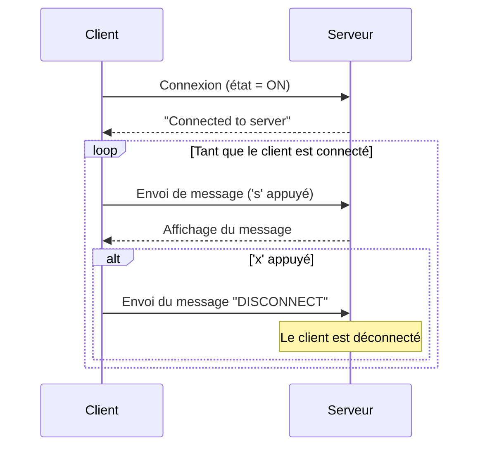

# Application Client-Serveur en C



Cette application est une simple implémentation d'un serveur et d'un client en C utilisant les sockets UDP. Le client peut envoyer des messages au serveur, qui les affiche. Le client peut également se déconnecter du serveur en envoyant un message spécial.

## Structure du Programme

Le programme est divisé en deux fichiers :

- `server.c` : Le code du serveur. Il crée un socket et écoute les messages entrants. Quand il reçoit un message d'un client, il l'affiche. Si le message est "DISCONNECT", le serveur considère que le client s'est déconnecté.
- `client.c` : Le code du client. Il crée un socket et envoie un message au serveur pour établir la connexion. Il peut ensuite envoyer des messages au serveur en appuyant sur une touche. Si l'utilisateur appuie sur 'x', le client envoie un message de déconnexion au serveur et se ferme.

## Interactions Réseaux

Le programme utilise le protocole UDP pour les communications réseau. Les messages sont envoyés en clair sans aucun cryptage ou autre forme de sécurisation.

Voici une description de chaque interaction réseau :

- Quand le client démarre, il envoie un message au serveur pour indiquer qu'il est connecté.
- Le serveur reçoit ce message et envoie une réponse au client.
- Le client peut ensuite envoyer des messages au serveur en appuyant sur la touche 's'.
- Le serveur affiche chaque message reçu.
- Si le client envoie le message "DISCONNECT", le serveur considère que le client s'est déconnecté.

## Utilisation de l'Application

Pour utiliser l'application, vous devez d'abord compiler les deux fichiers. Vous pouvez le faire avec la commande `gcc` comme suit :

```bash
gcc -o server server.c
gcc -o client client.c
